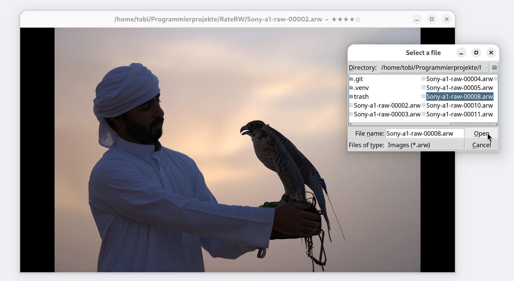

# RateRW



RateRW is a simple program to view, rate and
manage ARW files.

## Installation

Make sure you have python3 and python3-pip
installed.

First, clone the repository:

```
git clone https://github.com/koslowto/RateRW
cd RateRW/
```

Then, install the dependencies inside a
virtual environment:

```
python3 -m venv .venv
pip install -r requirements.txt
```

Finally, run the programm:

```
source .venv/bin/activate
python3 main.py
```

## Usage

- Navigate using the arrow keys.
- To open the file picker press "o".
- Ratings are assigned with the corresponding
  number keys.
- Due to the images being cached,
  modifications to files will not immediately
  take affect. Press "r" to refresh the image
  cache.

## Image Management

The ratings will be written to the file's
xmp metadata. A rating of zero stars, means,
the image hasn't been rated yet. You can also
apply a 0 star rating yourself; this won't
affect file deletion by default.

The script "delete.py" moves all files with a
rating of 1 star into a folder named "trash".
This allows for easy bulk deletion. Feel free
to modify the script to adjust this behaviour

## Enjoy :)
